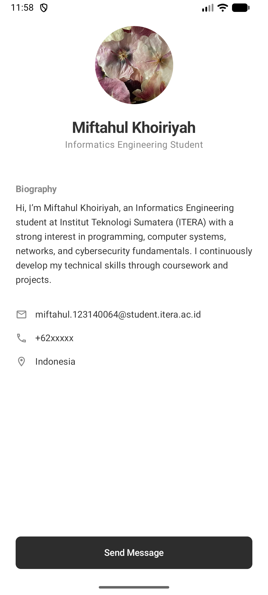

# Aplikasi Profil Minimalis (Tugas 3)

Aplikasi ini adalah halaman profil pengguna yang dibangun menggunakan **Jetpack Compose Multiplatform**. Desain difokuskan pada estetika minimalis, bersih, dan modern.

## Fitur & Komponen Reusable
Aplikasi ini menggunakan minimal 3 fungsi Composable yang dapat digunakan kembali:
1.  **`ProfileHeader`**: Menampilkan foto profil circular (melingkar), nama lengkap, dan status/jurusan.
2.  **`ProfileCard`**: Container minimalis untuk menampilkan biografi singkat pengguna.
3.  **`InfoItem`**: Komponen baris informasi yang menggabungkan ikon Material Outlined dengan detail teks (Email, Telepon, Lokasi).

## Screenshot Hasil Running


## Cara Menjalankan Aplikasi
Aplikasi ini dapat dijalankan di berbagai platform (Android, Desktop, iOS).

### Android
1.  Buka project di **Android Studio**.
2.  Pastikan file `Flowers.jpg` sudah berada di folder `composeApp/src/commonMain/composeResources/drawable/`.
3.  Pilih modul **`composeApp`** di toolbar atas.
4.  Klik tombol **Run** (ikon play hijau) atau gunakan shortcut `Shift + F10`.

### Desktop (JVM)
Jalankan perintah berikut di terminal:
```shell
.\gradlew.bat :composeApp:run
```

## Struktur Proyek
- `commonMain`: Berisi logika UI utama (App.kt) yang dibagikan ke semua platform.
- `composeResources`: Tempat penyimpanan aset gambar (Flowers.jpg) dan ikon.

---

**Nama:** Miftahul Khoiriyah  
**Instansi:** Institut Teknologi Sumatera (ITERA)
