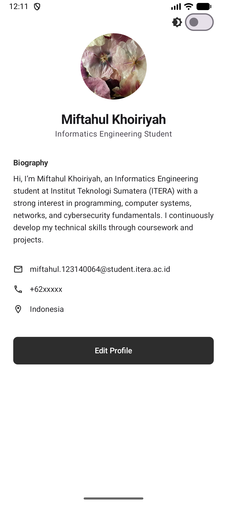
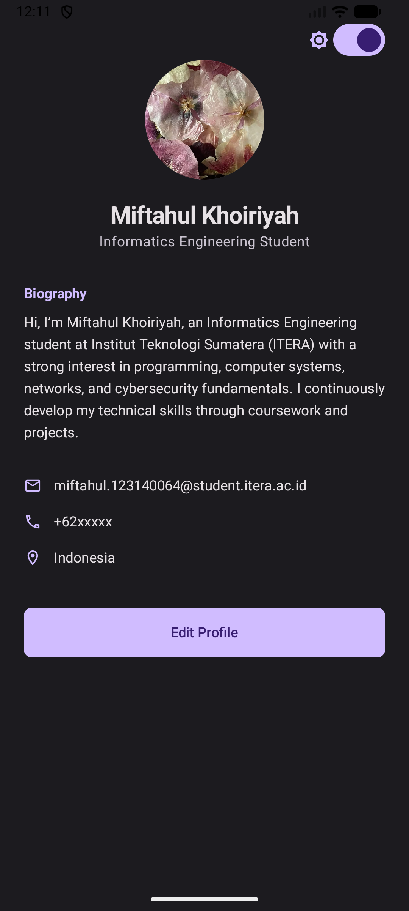
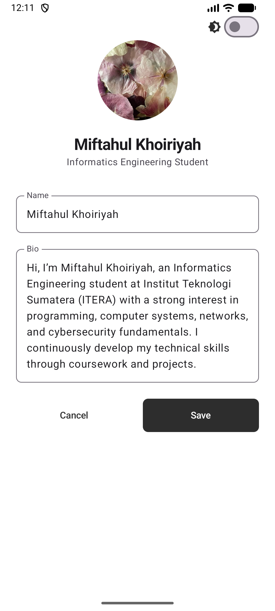

# Profile App - Kotlin Multiplatform (Tugas Pengembangan Aplikasi Mobile)

Aplikasi profil modern yang dikembangkan menggunakan **Compose Multiplatform** dengan penerapan arsitektur **MVVM (Model-View-ViewModel)**. Aplikasi ini mendukung fitur kustomisasi profil, tema adaptif (Dark/Light mode), dan pengelolaan state yang reaktif.

## Fitur Utama

### 1. Tampilan Profil Minimalis
Menampilkan informasi personal secara bersih menggunakan komponen Material 3:
- Foto profil circular (melingkar).
- Nama dan deskripsi pekerjaan/pendidikan.
- Detail kontak (Email, Phone, Location) dengan ikon yang elegan.

### 2. Fitur Edit Profile (State Hoisting)
Pengguna dapat mengubah Nama dan Biografi melalui form interaktif:
- Menggunakan `TextField` dengan *state hoisting* untuk menangani input sementara.
- Tombol **Save** untuk memperbarui data ke sistem secara permanen.
- Tombol **Cancel** untuk membatalkan perubahan tanpa memperbarui state utama.

### 3. Dark Mode Toggle
Implementasi tema dinamis yang memungkinkan pengguna beralih antara tema terang dan gelap secara instan melalui switch di pojok layar. Seluruh komponen UI akan menyesuaikan skema warna (background, surface, text) secara otomatis.

---

## Implementasi MVVM Pattern

Aplikasi ini memisahkan logika bisnis dari tampilan menggunakan pola arsitektur MVVM:

### 1. Model (Data Class / UI State)
Terletak di `ProfileUiState`, mendefinisikan seluruh status data yang dibutuhkan oleh UI dalam satu objek tunggal (Single Source of Truth).
```kotlin
data class ProfileUiState(
    val name: String,
    val bio: String,
    val isDarkMode: Boolean,
    val isEditing: Boolean,
    // ... detail lainnya
)
```

### 2. ViewModel (`ProfileViewModel`)
Bertindak sebagai perantara yang mengelola logika dan aliran data:
- Menggunakan **`StateFlow`** dari Kotlin Coroutines untuk memancarkan perubahan status secara reaktif.
- Menyediakan fungsi-fungsi aksi seperti `toggleDarkMode()`, `setEditing()`, dan `updateProfile()`.
- Menjamin data tetap konsisten meskipun terjadi perubahan konfigurasi.

### 3. View (Jetpack Compose UI)
Layer tampilan yang hanya bertugas merender UI berdasarkan state dari ViewModel:
- Menggunakan **`collectAsState()`** untuk mengamati perubahan data secara real-time.
- Menerapkan komponen reusable seperti `ProfileHeader`, `ProfileCard`, dan `InfoItem`.

---

## Dokumentasi Visual

| Light Mode | Dark Mode | Edit Mode |
| :---: | :---: | :---: |
|  |  |  |

---

## Cara Menjalankan

1. **Persiapan Resource**: Pastikan file `Flowers.jpg` berada di folder `composeApp/src/commonMain/composeResources/drawable/`.
2. **Sync Project**: Lakukan *Gradle Sync* di Android Studio.
3. **Run**:
   - Untuk Android: Pilih modul `composeApp` lalu klik **Run**.
   - Untuk Desktop: Jalankan perintah `./gradlew :composeApp:run` di terminal.

**Disusun Oleh:** Miftahul Khoiriyah  
**Jurusan:** Teknik Informatika - ITERA
