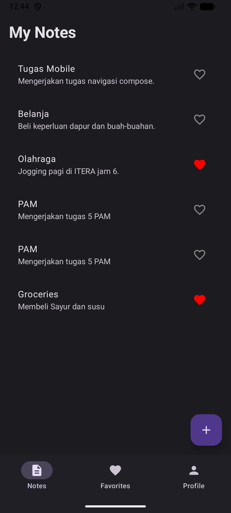
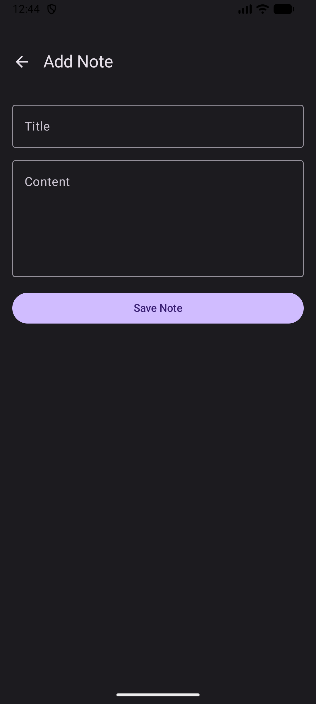
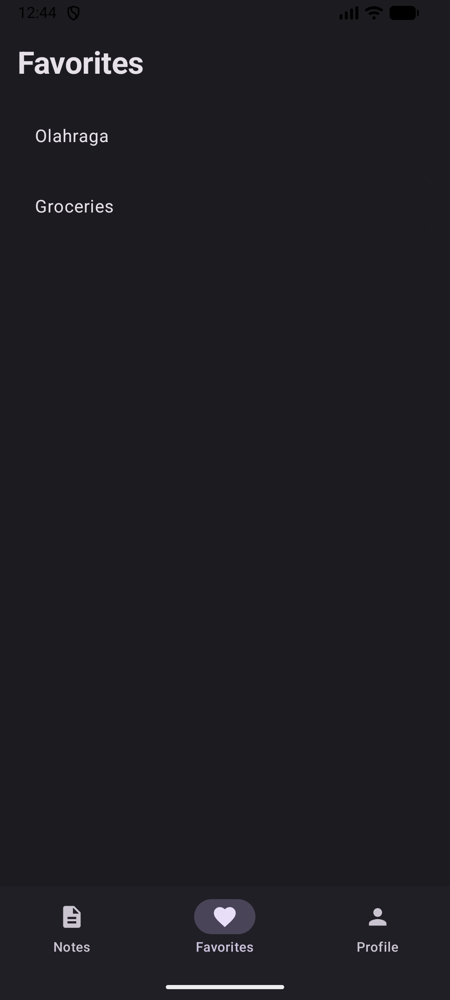
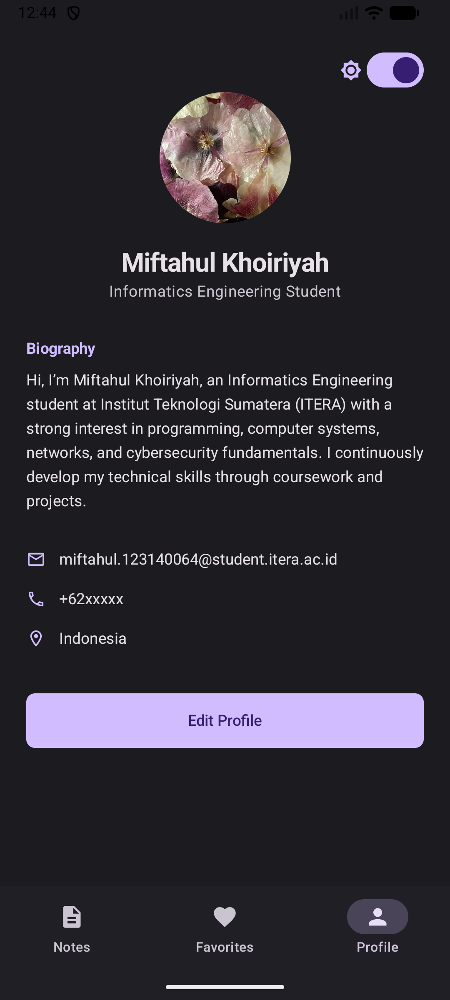

# Notes & Profile App - Tugas 3 Pengembangan Aplikasi Mobile

Aplikasi manajemen catatan (Notes) yang dibangun menggunakan **Kotlin Multiplatform** dan **Jetpack Compose**. Aplikasi ini mengimplementasikan fitur navigasi modern, pola arsitektur MVVM, dan manajemen data yang reaktif.

## 📺 Demo Aplikasi
Lihat demo aplikasi pada tautan berikut:
**[YouTube Video Demo](https://youtu.be/zzMqYlv9trM)**

---

## 🛠️ Penjelasan Implementasi Kode

### 1. Notes List (`NotesScreen`)
Layar utama yang menampilkan daftar seluruh catatan. Menggunakan `LazyColumn` untuk performa rendering yang optimal. Data diambil secara reaktif dari `NoteViewModel` menggunakan `StateFlow`.
- **Fitur**: Menampilkan judul, cuplikan konten, dan status favorit (Heart Icon).

### 2. Floating Action Button (FAB)
Tombol melayang yang terletak di pojok kanan bawah layar daftar catatan.
- **Kode**: Implementasi di dalam `Scaffold` menggunakan `FloatingActionButton`.
- **Fungsi**: Memicu navigasi ke `AddNoteScreen` menggunakan `navController.navigate()`. Tombol ini otomatis hanya muncul pada tab Notes.

### 3. Back Navigation
Implementasi navigasi mundur yang konsisten di seluruh layar detail dan form (Add & Edit).
- **Kode**: Menggunakan `navController.popBackStack()`.
- **Kegunaan**: Memastikan pengguna dapat kembali ke layar sebelumnya dengan menekan ikon panah kembali di TopAppBar tanpa merusak urutan tumpukan layar (*backstack*).

### 4. Edit Notes (`EditNoteScreen`)
Fitur untuk memperbarui catatan yang sudah ada.
- **Implementasi**: Mengirimkan `noteId` sebagai argumen navigasi dari layar Detail ke layar Edit.
- **Fungsi**: Memuat data lama ke dalam `TextField` melalui ViewModel, kemudian menjalankan fungsi `updateNote()` untuk menyimpan perubahan ke StateFlow.

---

## 📐 Arsitektur MVVM
Aplikasi ini memisahkan antara UI (View) dan Logika Bisnis (ViewModel):
- **Model**: `Note` data class yang mendefinisikan struktur data catatan.
- **View**: Komponen Composable di `App.kt` yang mengamati status data.
- **ViewModel**: `NoteViewModel` dan `ProfileViewModel` yang mengelola status aplikasi (UI State) dan menangani aksi pengguna.

---

## 🖼️ Galeri Hasil Running

| List Catatan | Tambah Catatan | Favorit | Profil Pengguna |
| :---: | :---: | :---: | :---: |
|  |  |  |  |

---

**Disusun Oleh:**  
**Nama:** Miftahul Khoiriyah  
**Jurusan:** Teknik Informatika  
**Instansi:** Institut Teknologi Sumatera (ITERA)
